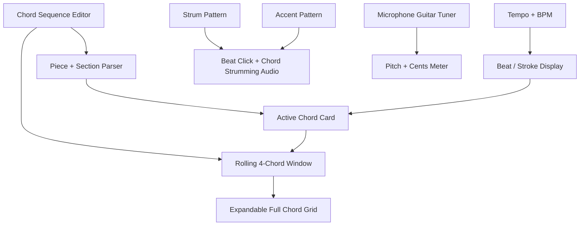
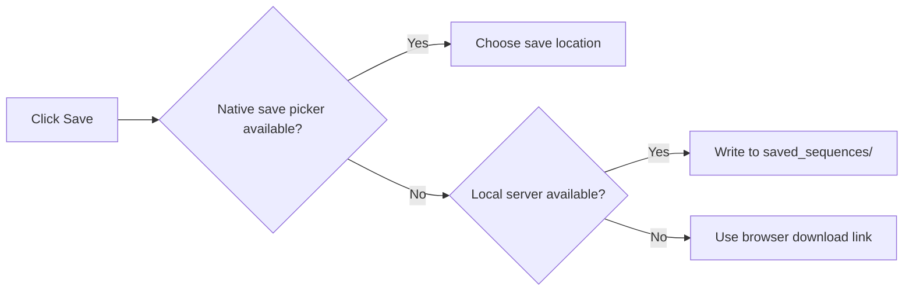

# Chord Strumming Trainer


Chord Strumming Trainer is a browser-based guitar practice tool that combines a metronome, strumming pattern trainer, chord progression viewer, chord fingering diagrams, lightweight synthesized guitar-chord playback, and a microphone guitar tuner.

It is built as a small static web app with an optional local Python server for saving chord-sequence files directly to disk.

## What It Does

- Plays a BPM-based strumming metronome from 40 to 180 BPM.
- Steps tempo by 20 BPM when the BPM number is clicked, wrapping from 180 back to 40.
- Supports editable strumming patterns with `D`, `U`, `X`, and `R`.
- Supports three-level accents: off (`-`), light (`>`), and strong (`>>`).
- Plays guitar-like chord strums that follow the accent pattern.
- Plays an individual chord on a long press of its chord card; tapping still cycles available fingerings.
- Provides one-click mute controls for beat clicks and chord strums.
- Tunes a live guitar through the microphone with cents feedback, open-string target selection, alternate tunings, and reference tones.
- Shows the active beat, current stroke, active chord, section annotation, and chord diagram.
- Displays a rolling four-chord window so long pieces do not cause dramatic layout shifts.
- Expands to a full-piece chord grid for changing alternate chord fingerings.
- Loads chord progressions from `.txt` or `.chords` files.
- Saves chord progressions through the native browser picker when available, through the local server when running with `server.py`, or through a download fallback.
- Works well on mobile phones with compact one-row beat and accent controls, responsive chord cards, and touch-friendly transport controls.

## Playback Controls

- The center counter is the primary transport control.
- The version number beside the app title links to this README.
- Click the BPM number to step tempo by 20 BPM; double-click it to reset to the default 126 BPM.
- Before playback, the counter shows a blue play icon.
- During playback, the counter shows the active beat number in red.
- When paused, the counter shows the blue play icon again.
- Double-click the counter area to reset to the beginning.
- The transport button mirrors the same states: `Start` and `Continue` are blue, while `Pause` is red.

## App Layout



## Chord Sequence Format

Chord sequences are plain text. Separate items with spaces, commas, or bars.

```text
Piece:Beautiful-One-Simplified Anno:Intro F G F G F G C C
Anno:Verse1 F G C F G Am F G C F G C
```

Supported annotations:

- `Piece:xxx` sets the piece name shown beside `CHORDS`.
- `Anno:xxx` sets the current section label shown above the active chord.
- Chord names create measures in the sequence.

If `Piece:xxx` is omitted, the piece name defaults to `Unnamed Pice`.

## Strumming Pattern Format

The strum pattern editor accepts these symbols:

| Symbol | Meaning |
| --- | --- |
| `D` | Down strum |
| `U` | Up strum |
| `X` | Muted/percussive hit |
| `R` | Rest |

Example:

```text
D U D U D U D U
```

## Accent Pattern

Each accent slot cycles through three states:

| Display | Level | Effect |
| --- | --- | --- |
| `-` | Off | No chord strum for that slot |
| `>` | Light | Softer beat and chord strum |
| `>>` | Strong | Louder beat and chord strum |

Default accent pattern:

```text
>> > > >> > > >> >
```

When `Beat accent` is enabled, both beat clicks and chord strums follow the accent pattern. When it is disabled, beat clicks and chord strums keep playing at a constant normal level instead of using the accent pattern or muting `-` slots.

## Guitar Tuner

The built-in tuner follows the familiar online guitar-tuner workflow:

- Open the tuner from the tuning-fork button at the left of the top row; it replaces the metronome and chord practice controls and immediately requests microphone access.
- Click the chord icon in the same button to return to the chord practice view.
- Closing the tuner view automatically turns the microphone off.
- Click `Retune` to clear completed-string check marks and tune the guitar again.
- Use `Standard`, `Drop D`, `Open G`, or `Half step down` tuning.
- Leave `Auto` enabled beside the current target to identify the nearest target string, or turn it off and select a specific string.
- Read the input level, detected note, flat/sharp cents offset, and center marker/needle for in-tune feedback.
- The last tuning reading stays visible briefly while a note decays, and a green check marks strings held in tune.
- The string buttons show target pitches such as `E2 A2 D3 G3 B3 E4`, positioned beside their matching headstock tuning machines.
- The target strings are arranged around a realistic acoustic guitar headstock for a more natural tuning reference.
- Use `Tone` to play the current target string as a reference pitch.

Starting metronome playback turns the microphone tuner off so the generated click and chord sounds are not misread as the instrument.

The interaction model was informed by the [GuitarTuna Online Guitar Tuner](https://guitartuna.com/online-guitar-tuner): standard open-string tuning, microphone-based feedback, and alternate tuning targets. This app implements its own interface and Web Audio pitch-detection code.

## Chord Graphics And Fingerings

Each chord card shows:

- Six strings.
- Fret lines.
- Open or muted string markers.
- Finger-position dots.
- A fingering counter such as `1/3` when alternate shapes are available.

Click a chord card to cycle its fingering. The active chord card can also be clicked to change the current chord fingering.

## Running The App

### Public GitHub Pages Site

The app is configured for GitHub Pages with GitHub Actions. After Pages is enabled for the repository, pushes to `main` deploy the static app automatically.

Expected public URL:

```text
https://techtony2018.github.io/Chord-Strumming-Trainer/
```

### Simple Static Mode

Open `index.html` directly in a browser.

This supports practice, loading local files, and browser-based download behavior.

### Save-Capable Local Server

Run:

```bash
python3 server.py
```

Then open:

```text
http://127.0.0.1:4173
```

When running through `server.py`, the `Save` button writes chord files into:

```text
saved_sequences/
```

That folder is ignored by Git because it contains user-generated practice files.

## Browser Save Behavior



Notes:

- Chrome and Edge can use the native file picker when the File System Access API is available.
- Firefox does not support `showSaveFilePicker()`. Firefox users can enable `Always ask you where to save files` in Firefox settings to choose a download folder.
- The Codex in-app browser lacks some normal browser file APIs, so `server.py` is the most reliable save path there.

## Project Files

| File | Purpose |
| --- | --- |
| `index.html` | App structure and controls |
| `styles.css` | Responsive layout and chord diagram styling |
| `app.js` | Metronome scheduler, pitch detection, audio, parsing, chord rendering, file actions |
| `server.py` | Optional local server with save endpoint |
| `.gitignore` | Ignores generated saved sequences and macOS metadata |

## Development Notes

The app uses the Web Audio API for timing and synthesized sounds. Chord playback is intentionally lightweight: each accented slot triggers a staggered set of filtered, harmonic-rich plucked-string buffers with small pick-noise transients to mimic a guitar strum without requiring external audio assets.

The chord window is deliberately limited to four cards during playback. For long pieces, the visible window advances around the active measure so the UI remains stable and readable.

Current version: `v1.031`
